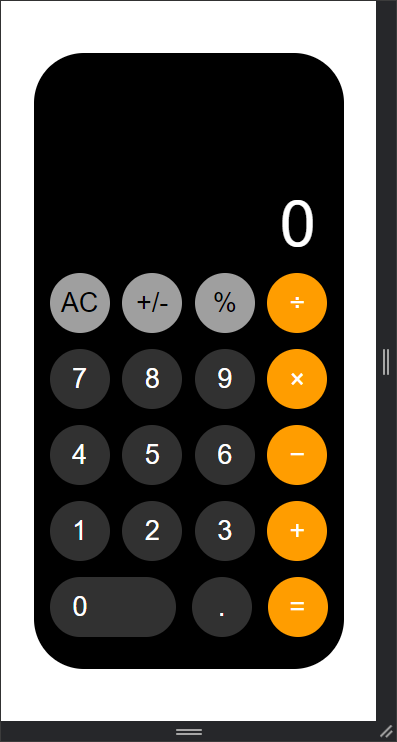

# Level 1 (Task 3) - Calculator

Introducing my most recent project: an elegant and useful calculator made with JavaScript, HTML, and CSS! This intuitive UI makes it easy to crunch numbers and streamlines your calculations. Examine its user-friendly layout and relish its flawless operation. Check it out right now to make your math assignments easier! 

