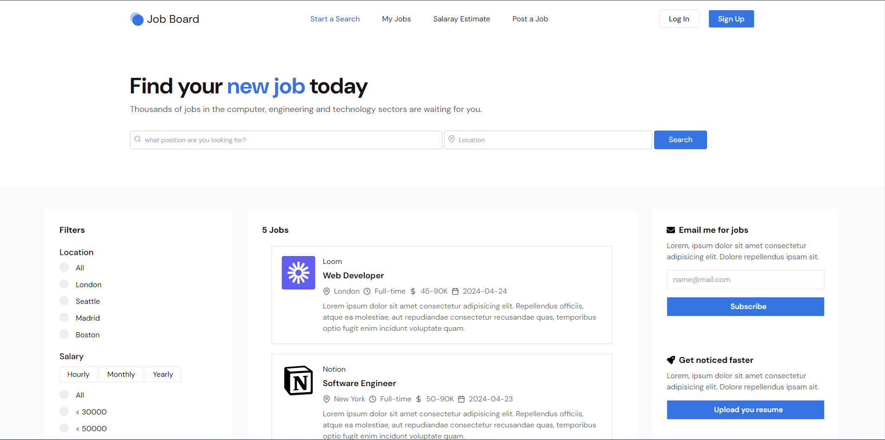

# Level 2 (Task 2) - Job Board

Introducing our newest creation, a powerful job board that runs on the MERN stack! We've created a dynamic platform that links bright workers with intriguing career possibilities by utilizing MongoDB, Express.js, React.js, and Node.js. Utilize a single, user-friendly interface to interact with companies, apply for jobs, and browse job listings with ease. Take a look at the job hunt of the future right now!

